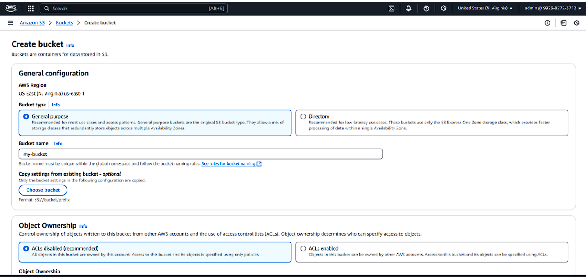
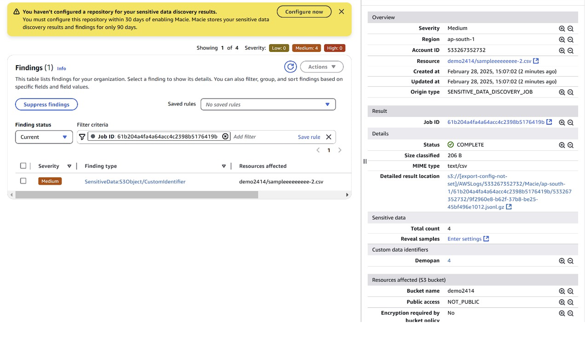

# AWS Macie Lab – Detecting PAN Card Data in S3

This lab demonstrates how to use AWS Macie to identify sensitive data (like PAN card numbers) in Amazon S3 documents.

## 🧠 Objective
Use AWS Macie to scan S3 documents and identify sensitive data such as PAN numbers using custom identifiers.

## 🛠️ Tools
- AWS S3  
- AWS Macie  
- Custom Regex Identifier  

## 📝 Procedure

### 1. Create an S3 Bucket
Upload:
- A `.csv` file with sensitive data  
- A `.txt` file  

### 2. Enable AWS Macie
- Go to AWS Console → Macie → Enable if not done

### 3. Create a New Scan Job
- Select the uploaded S3 bucket  
- Set Job Frequency: One-time  
- Include file extensions: `.csv`  

### 4. Configure Data Identifiers
- Select **Custom** identifiers

### 5. Create Custom Identifier
- Go to “Manage Custom Identifiers”
- Name: `PANCard`
- Regex: `[A-Z]{5}[0-9]{4}[A-Z]`  
- Severity: Medium  
- Save the identifier  

### 6. Assign Identifier to Job
- Select your new identifier  
- Name the job  
- Submit and wait ~10 minutes for results  

### 7. Verify Results
- Open the Job Results  
- Confirm PAN data detection  

## ✅ Outcome
Successfully detected sensitive PAN card data in files stored in S3 using a custom regex identifier in AWS Macie.

## 🖼️ AWS Macie Job Result Screenshot

